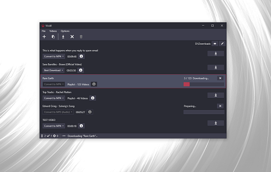

# Vividl

[](https://github.com/bluegrams/vividl/blob/master/LICENSE.txt)
[](https://github.com/bluegrams/vividl)
[](https://sourceforge.net/projects/vividl/files/)

> Free video downloader for Windows

[](https://sourceforge.net/projects/vividl/files/)

Vividl is a Windows app that lets you download videos from various websites, including YouTube, Vimeo and Dailymotion.
It uses the popular program [youtube-dl](https://ytdl-org.github.io/youtube-dl/index.html) to extract videos
from [several hundred websites](https://ytdl-org.github.io/youtube-dl/supportedsites.html). Just copy a video URL,
paste it in Vividl and download the video in different qualities, convert it to other formats or to an audio track.
You can also manage the parallel download of multiple videos and retrieve additonal meta information using the simple UI.

<p align="center">

</p>

## Features

- Download videos from all important websites with the help of youtube-dl
(see [all sites supported by youtube-dl](https://ytdl-org.github.io/youtube-dl/supportedsites.html))

- Select between all provided download formats

- Convert videos to MP4, AVI, WebM...

- Extract audio track as MP3, M4A...

- Download multiple videos in parallel

- See additional information before downloading a video

- Modern and powerful UI for Windows

## Setup

#### Requirements

Vividl requires Windows 7 or newer with the following components installed:
- [.NET Framework v.4.6.2](https://www.microsoft.com/de-de/download/details.aspx?id=53345) or higher
- [Microsoft Visual C++ 2010 Redistributable Package (x86)](https://www.microsoft.com/de-de/download/details.aspx?id=8328)

#### Get Vividl

- Download the [latest release from SourceForge](https://sourceforge.net/projects/vividl/files/)

or

- Install from [Chocolatey](https://chocolatey.org):
```
choco install vividl
```

## Version History

Read [the changelog](https://github.com/bluegrams/vividl/blob/master/Changelog.md) to see changes in each version.

## Feedback and Support

_Please leave a feedback on [SourceForge](https://sourceforge.net/p/vividl/reviews) and
	recommend Vividl if you like it. Thank you!_

Places to get help:

- Ask on [SourceForge](https://sourceforge.net/p/vividl/discussion) (General help, ideas etc.)
- Open an issue on [GitHub](https://github.com/bluegrams/vividl/issues) (Bugs, feature requests etc.)

## Contribute

You are very welcome to contribute fixes and new features by opening a
[pull request on GitHub](https://github.com/bluegrams/vividl/pulls).

See all the great people that have contributed in the [list of contributors](https://github.com/bluegrams/vividl/blob/master/CONTRIBUTORS.md).
Make sure to add yourself in your pull request!

## License

This software is published under the [BSD-3-clause license](LICENSE.txt) by Bluegrams.

## Credits

- [youtube-dl](https://ytdl-org.github.io/youtube-dl/index.html) is licensed under The Unlicense
- [FFmpeg](https://www.ffmpeg.org/) is licensed under GNU LGPL v2.1
- [Adonis UI](https://github.com/benruehl/adonis-ui) is licensed under MIT license
- [MVVM Light](http://www.mvvmlight.net/) is licensed under MIT license
- [MahApps.Metro.IconPacks](https://github.com/MahApps/MahApps.Metro.IconPacks) is licensed under MIT license
- [Wpf.Notifications](https://github.com/Enterwell/Wpf.Notifications) is licensed under MIT license
- [YoutubeDLSharp](https://github.com/bluegrams/YoutubeDLSharp) is licensed under BSD-3-clause license
- Icons by @templarian, [ModernUIIcons.com](http://modernuiicons.com/), licensed under CC BY-ND 3.0
